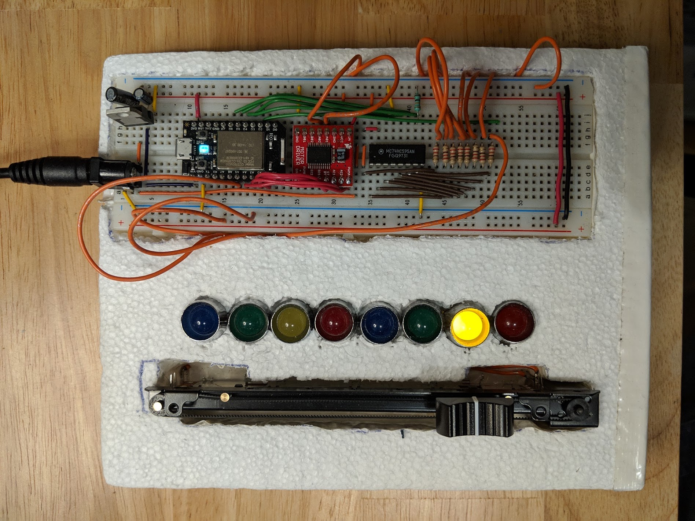

# TogglBoard

The most overly complicated time-tracking device ever created!

TogglBoard is a physical time-tracking device that connects to the Toggl API, so that I can quickly toggle between 7 different active projects. It's fanciest feature is the two-way sync; thanks to a motorized slider, the TogglBoard device can have it's active project overridden if I change the active project via any of the Toggl apps :tada: :robot:

It's still a work in progress, though.

## TogglBoard Device
The device is powered by a Particle Core, a fantastic little WiFi-enabled IoT device that's been discontinued in favour of the new [Particle Photon](https://store.particle.io/products/photon). The core interfaces with a [motorized slide potentiometer](https://www.sparkfun.com/products/10976) that the user can slide up and down to choose between 8 different active projects to begin a new time entry in Toggl. If the device receives a command to change the current project (e.g. the user changed the project via the Toggl website), the motor is used to automatically slide the switch to the correct new position using a classic, closed-loop PID controller. This achieves the "two-way" sync, which means the device and the API are always displaying the same active project.

Overall, this requires:
* Particle Core WiFi-enabled Microcontroller
* Motorized Slide Potentiometer
* Motor Driver
* Shift Register (for lots of LEDs)
* ...and lots of LEDs

## TogglBoard Server
The server implements the logic that syncs the device and the Toggl API. That's rather mundane, so to make things interesting, it uses a handful of wholly unnecessary technologies; it's a:
* Node.JS Server Application
* ...compiled from Typescript
* ...unit tested with Jest
* ...containerized with Docker
* ...built with Azure Pipelines CI ([here](https://dev.azure.com/nevilles/toggl-board/_build/latest?definitionId=1))
* ...deployed with Azure Pipelines CD ([here](https://dev.azure.com/nevilles/toggl-board/_releases2))
* ...hosted with Azure Web App for Containers ([here](https://togglboard.azurewebsites.net/current))

