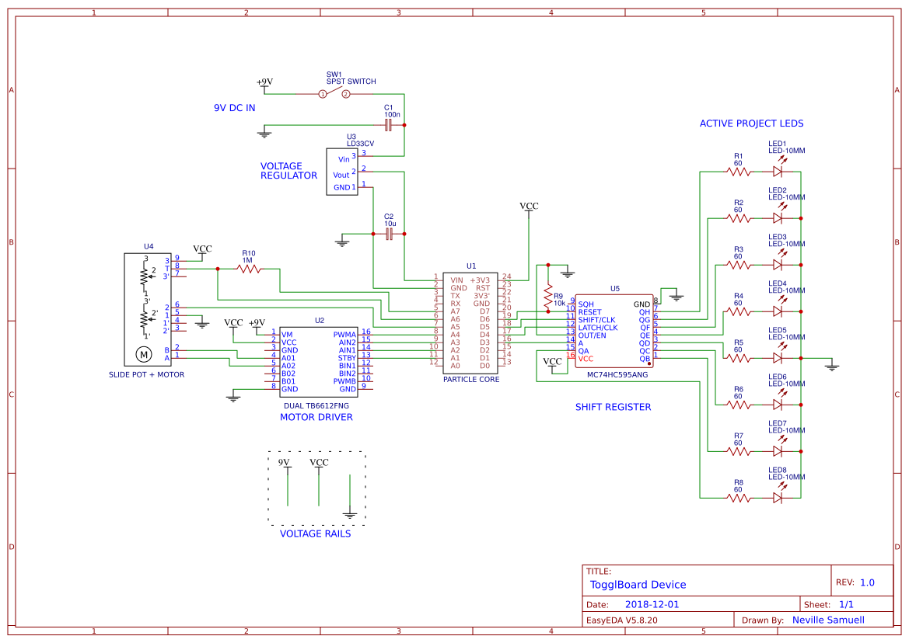

# TogglBoard Device

This folder contains the design files for the TogglBoard Device with the physical controls. For more info, see the [README](../README.md)

## Schematic

## BOM

| Designator | Name              | Quantity |
|------------|-------------------|----------|
| U1         | PARTICLE CORE     | 1        |
| U2         | DUAL TB6612FNG    | 1        |
| U4         | LD33CV            | 1        |
| U5         | SLIDE POT + MOTOR | 1        |
| U6         | MC74HC595ANG      | 1        |
| SW1        | SPST SWITCH       | 1        |
| LED1-9     | LED-10MM          | 9        |
| LED10-12   | LED-3MM           | 3        |
| R1-12      | 60                | 12       |
| C1         | 100n              | 1        |
| C2         | 10u               | 1        |
| R13        | 1M                | 1        |

## Microcontroller Code

See the [source code](./code/) for the sketch file used in the Particle Core.
